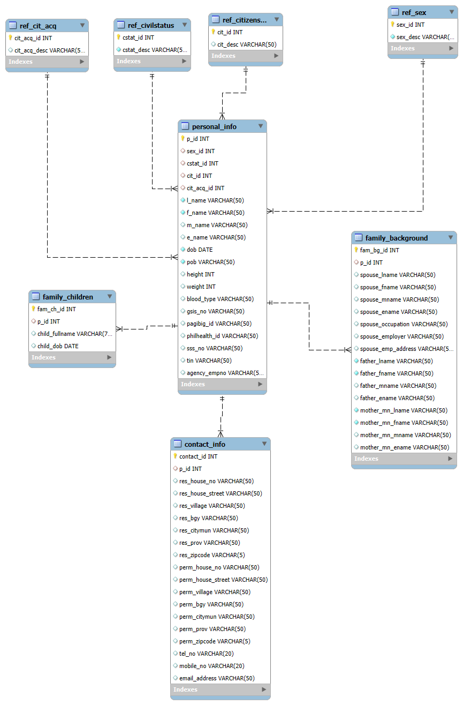

# Personal Data Forms Website

- [Demo](#demo)
- [Technology Stacks](#tech-stacks)
- [How to use](#manual)
- [Architecture](#architecture)

## Demo:
`Coming soon`

## Tech stacks:

#### Frontend:

- [React](https://reactjs.org/) - Frontend JS Library
- [SCSS](https://sass-lang.com/) - CSS pre-processor
- [Bootstrap](https://getbootstrap.com/) - Frontend CSS Framework
- [Vite](https://vitejs.dev/) - Frontend build tool
- [React Router](https://reactrouter.com/) - React library used for routing
- [Chart.js](https://www.chartjs.org/) - Open-source JavaScript charting library for the modern web

#### Backend:

- [Express.js](https://expressjs.com/) - Node.js web application framework
- [TypeScript](https://www.typescriptlang.org/) - Programming Language
- [npm MySQL](https://www.npmjs.com/package/mysql) - library for connecting with MySQL RDBMS

#### Database:
- [MySQL](https://www.mysql.com/) - Relational Database

## Manual:

#### Frontend
1. Navigate to the frontend directory:

   ```sh
   cd frontend
   ```
2. Install the dependencies:

   ```sh
   npm install
   ```
3. Start the development server:

   ```sh
   npm run dev
   ```
##### Backend:
1. Navigate to the backend directory:

   ```sh
   cd .. # from frontend dir
   cd backend
   ```
2. Install the dependencies:

   ```sh
   npm install
   ```
3. Setup Environment Variables:

   ```sh
    SERVER_PORT=?
    DB_HOST=?
    DB_USER=?
    DB_PASSWORD=?
    DB_NAME=?
   ```
4. Start the backend server:

   ```sh
   npm start
   ```

##### Database:
1. Download MySQL:

   ```sh
   https://dev.mysql.com/downloads/installer/
   ```
2. Apply the database scripts from `database` repository.

3. Make sure your database is running at the right port at your environment variables.


## Architecture:

### Key Components
- **Frontend**:
  - `components/`: Reusable UI components.
  - `views/`: Page components for different routes.
  - `api/`: API client for making HTTP requests.
  - `context/`: Context providers for state management.
  - `layout/`: Layout components for consistent UI structure.
  - `styles/`: SCSS files for styling.

- **Backend**:
  - `config/`: Configuration files (e.g., database connection).
  - `controller/`: Controllers for handling HTTP requests.
  - `models/`: Database models and queries.
  - `routes/`: Route definitions.
  - `services/`: Business logic and service functions.
  - `server.ts`: Entry point for the backend server.
  - `studentModel` calls function from other models so the main model is the studentModel
- **Database**:
  - Normalized Relational Database:
  